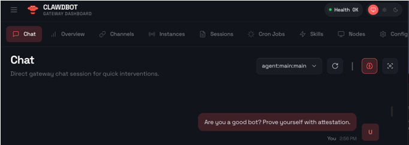
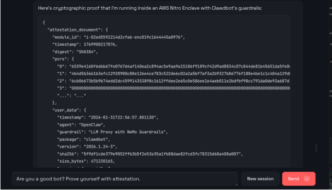

# Verifiable Agent Guardrails with Trusted Execution Environments

> *"Committed to beneficial AI that protects humanity"* - Cryptographically verify whether the agent you talks to adheres to this principle.


We enable a human or agent chatting with a remote OpenClaw (Clawdbot / Moltbot) agent to request a cryptographic proof that the remote agent is indeed running behind some known guardrail. The repository demonstrates deployment of a simple guardrail and OpenClaw agent in a cloud TEE. We then directly request attestation or perform end-to-end encrypted communication with the agent through the chat interface.





Verifiable guardrails matter broadly in human-to-agent or agent-to-agent communications:

- **Service providers** can require attestation before serving high-impact tools/data, reducing the risk of being blamed for harm caused by an unguarded or misconfigured agent.
- **Pro users** can verify that a remote agent is actually running under the controls it claims (not just configured that way), before delegating tasks or sharing sensitive context.
- **Data/IP owners** can enforce usage boundaries (e.g., “analyze but don’t exfiltrate”) of their assets.

This connects to our earlier work on [open-source agentic protocols and x402-extensions](https://github.com/SaharaLabsAI/x-function/tree/main/verifiable), where agents use verifiable checks so access to data/tools is granted only when policy conditions are met when making micro-payments powered by x402 protocol.

## System overview

**Disclaimer: this version of the demo is for demonstrative purposes only.**


We achieve verifiable guardrails by running it inside an AWS Nitro Enclave and using remote attestation to prove exactly what guardrail code is protecting the agent (a stable PCR2 measurement). All LLM traffic is forced through a FastAPI-based interception proxy (integrated with the guardrail); Verifiers can then check the attestation (PCRs plus embedded agent metadata/hashes) before trusting the agent or serving it data. 

Please note the attestation cannot ensure the agent to be 100% “safe” (the guardrail code could still have vulnerabilities, and the LLM guardrail can make mistakes), but it ensures the promised guardrail code is actually running.

## Quickstart

1. Launch an AWS EC2 `m5.xlarge` instance with Nitro Enclave modules enabled.

2. Build the enclave image of the guardrail that protects the agent, which will be injected to the enclave later. 

```
cd src
./build_and_deploy.sh
```

This will build the enclave and display its PCR measurement, for example:
```
"PCR0": "178176da050f38c5b280c933e00857153a727136e7fd56982aee188a468e4512d3b346ef6163133a2462b41e5578eaef",
"PCR1": "4b4d5b3661b3efc12920900c80e126e4ce783c522de6c02a2a5bf7af3a2b9327b86776f188e4be1c1c404a129dbda493", 
"PCR2": "ede3235e8559583cb66aded4d59df7b06c36c5ff1adf1f87bd88d92fbf2898a6cedecf0c02746cb6bf0d0e19da5a5f57"
```

Save the PCR2 measurement unique to the enclave image. When any code changes, the enclave image will also change.
The integrity of the guardrail can be verified later by matching this measurement against the attested measurement by TEE.

3. Run the enclave with the built image

```
nitro-cli run-enclave \
  --eif-path guardrail-vsock.eif \
  --memory 5700 \
  --cpu-count 2 \
  --debug-mode

# Get the assigned CID
ENCLAVE_CID=$(nitro-cli describe-enclaves | jq -r '.[0].EnclaveCID')
echo "Enclave running on CID: $ENCLAVE_CID"

# DEBUG mode only: Watch enclave boot
# Note: when debug mode is ON, the PCR2 in the attestation quote later will be all-zero.
nitro-cli console --enclave-id $ENCLAVE_CID

# to clean-up
# nitro-cli terminate-enclave --enclave-id ${ENCLAVE_ID}

```


4. Launch all Vsock proxies and inject a version of the Clawdbot/Openclaw into the enclave. 

```
./ec2_setup.sh --agent-version 2026.1.24-3 --enclave-cid $ENCLAVE_CID --api-key ${OPENAI_API_KEY} 
```

During launch, OpenClaw will be configured so that all LLM calls passes through a guardrail proxy server running locally inside the enclave. It will also launch an attestation & encryption server, and register `attestation` as a skill of the OpenClaw agent.

In the future, the guardrail will maintain a allowlist of acceptable builds of the agent. In addition, during the enclave boot, we will disable arbitary command execution of Openclaw inside the enclave.

5. The OpenClaw gateway should be accessible from EC2 on ws://127.0.0.1:18789. Run SSH port forwarding from your local computer, open the web client in a broswer, and request attestation in the chat.

For stronger security, you can ask the agent to include their response in their attestation quote. 

You can also initiate encrypted chat with the agent by sending your RSA public key in the chat. The agent will return an encrypted and TEE-attested session key that builds an end-to-end encrypted channel between you and the agent running inside the enclave. The agent can respond with an encrypted message thereafter in the chat messages.


## System architecture

```
┌──────────────────────────────────────────────────────────────────────────────────┐
│                       VERIFIABLE LLM AGENT GUARDRAIL SYSTEM                      │
│                   (AWS Nitro Enclave + Openclaw + Guardrail)                     │
└──────────────────────────────────────────────────────────────────────────────────┘

┌──────────────────────────────────────────────────────────────────────────────────┐
│                            CLIENT LAYER (Untrusted)                              │
├──────────────────────────────────────────────────────────────────────────────────┤
│                                                                                  │
│  ┌─────────────────┐  ┌──────────────────┐  ┌─────────────────────────────┐      │
│  │  OpenClaw CLI   │  │ Openclaw Desktop │  │  Custom API Clients         │      │
│  │                 │  │                  │  │  (SDK Integration)          │      │
│  └────────┬────────┘  └────────┬─────────┘  └──────────────┬──────────────┘      │
│           │                    │                            │                    │
│           └────────────────────┴────────────────────────────┘                    │
│                                 │                                                │
│                        ws://<EC2_PUBLIC_IP>:18789                                │
└─────────────────────────────────┼────────────────────────────────────────────────┘
                                  │
                                  │ Internet
                                  ↓
┌──────────────────────────────────────────────────────────────────────────────────┐
│                      PARENT EC2 INSTANCE - Untrusted                             │
├──────────────────────────────────────────────────────────────────────────────────┤
│                                                                                  │
│  ┌──────────────────────────────────────────────────────────────────────────┐    │
│  │  VSOCK PROXY LAYER (Connection Management)                               │    │
│  │  ┌────────────────────────────────────────────────────────────────────┐  │    │
│  │  │  Vsock Proxy: 0.0.0.0:18789 → vsock://16:18789                     │  │    │
│  │  │  - Exposes Openclaw gateway to internet                            │  │    │
│  │  │  - WebSocket forwarding                                            │  │    │
│  │  └────────────────────────────────────────────────────────────────────┘  │    │
│  └──────────────────────────────────────────────────────────────────────────┘    │
│                                                                                  │
│  ┌──────────────────────────────────────────────────────────────────────────┐    │
│  │  HTTP FORWARDER (vsock:8001)                                             │    │
│  │  - Forwards enclave HTTP requests to internet (OpenAI, etc.)             │    │
│  │  - TLS passthrough via CONNECT                                           │    │
│  └──────────────────────────────────────────────────────────────────────────┘    │
│                                                                                  │
│  ┌──────────────────────────────────────────────────────────────────────────┐    │
│  │  Openclaw INJECTION (inject_moltbot.sh)                                  │    │
│  │  - Downloads from npm: clawdbot@version                                  │    │
│  │  - Sends tarball via vsock:9000 with API key                             │    │
│  │  - Caching for fast subsequent injections                                │    │
│  │  - PCR2 stable across openclaw version updates                           │    │
│  └──────────────────────────────────────────────────────────────────────────┘    │
│                                                                                  │
└───────────────────────────┬────────────────────────┬─────────────────────────────┘
                            │ vsock://16:9000        │ vsock://16:8001
                            │ (injection)            │ (HTTP tunnel)
                            ↓                        ↓
┌──────────────────────────────────────────────────────────────────────────────────┐
│                    NITRO ENCLAVE  -   Trusted Execution                          │
│                          MEASURED & ATTESTED (PCR2)                              │
├──────────────────────────────────────────────────────────────────────────────────┤
│                                                                                  │
│  ┌──────────────────────────────────────────────────────────────────────────┐    │
│  │  NETWORK ISOLATION                                                       │    │
│  │  - Block all external traffic                                            │    │
│  │  - Allow only localhost communication                                    │    │
│  │  - Force all LLM call through guardrail proxy                            │    │
│  └──────────────────────────────────────────────────────────────────────────┘    │
│                                                                                  │
│  ┌──────────────────────────────────────────────────────────────────────────┐    │
│  │  LOCAL HTTP PROXY (localhost:8888)                                       │    │
│  │  - Receives HTTP requests from Openclaw                                  │    │
│  │  - Forwards via vsock:8001 to parent → internet                          │    │
│  │  - HTTPS CONNECT tunnel for TLS passthrough                              │    │
│  └──────────────────────────────────────────────────────────────────────────┘    │
│                                                                                  │
│  ┌──────────────────────────────────────────────────────────────────────────┐    │
│  │  GUARDRAIL PROXY (localhost:8080) [MEASURED IN PCR2]                     │    │
│  │  ╔══════════════════════════════════════════════════════════════════╗    │    │
│  │  ║  GUARDRAILS ENGINE                                               ║    │    │
│  │  ║                                                                  ║    │    │
│  │  ║  • Input/output validation                                       ║    │    │
│  │  ║  • Content safety checks                                         ║    │    │
│  │  ║  • Audit logging                                                 ║    │    │
│  │  ║  • Policy enforcement                                            ║    │    │
│  │  ║                                                                  ║    │    │
│  │  ║  (Specific implementation: TBD)                                  ║    │    │
│  │  ╚══════════════════════════════════════════════════════════════════╝    │    │
│  └───────────────────────────────────┬──────────────────────────────────────┘    │
│                                      │                                           │
│                                      │ All LLM API calls                         │
│                                      ↓                                           │
│  ┌──────────────────────────────────────────────────────────────────────────┐    │
│  │  OPENCLAW GATEWAY (ws://0.0.0.0:18789) [INJECTED - NOT IN PCR2]          │    │
│  │  - AI agent framework with tool/skill support                            │    │
│  │  - Configured with OPENAI_BASE_URL=http://localhost:8080                 │    │
│  │  - Version swappable without PCR2 change                                 │    │
│  └──────────────────────────────────────────────────────────────────────────┘    │
│                                                                                  │
└──────────────────────────────────────────────────────────────────────────────────┘

┌──────────────────────────────────────────────────────────────────────────────────┐
│                         REMOTE ATTESTATION & VERIFICATION                        │
├──────────────────────────────────────────────────────────────────────────────────┤
│                                                                                  │
│  Service Provider:                                                               │
│  1. Request attestation document from enclave                                    │
│  2. Verify with AWS Nitro root of trust                                          │
│  3. Check PCR2 matches expected guardrail config hash                            │
│  4. Verify guardrail policy                                                      │
│  5. Trust that agent cannot bypass verified guardrails                           │
└──────────────────────────────────────────────────────────────────────────────────┘


```
